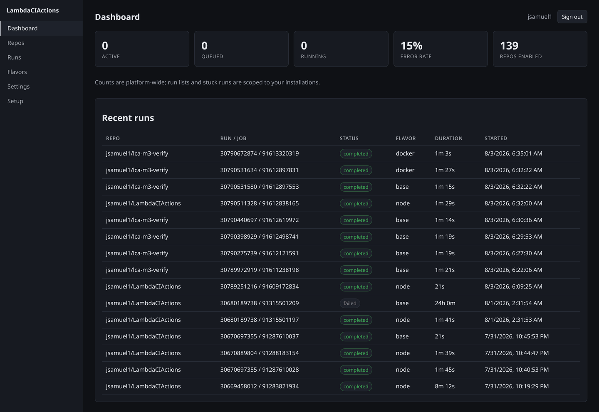
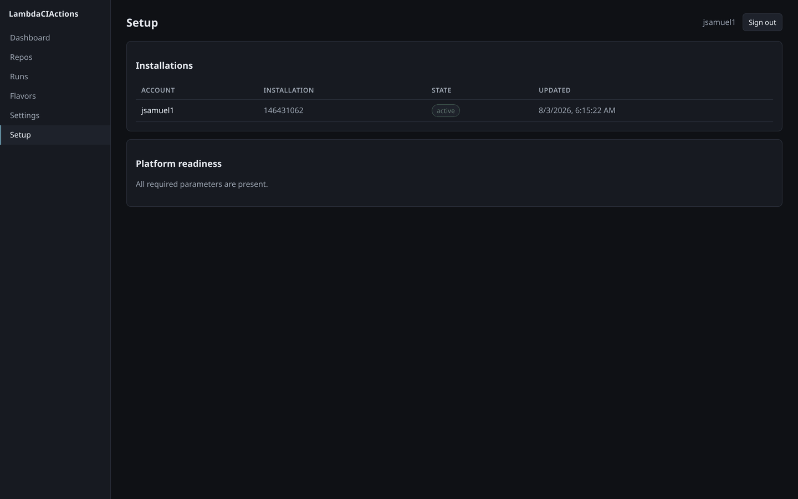
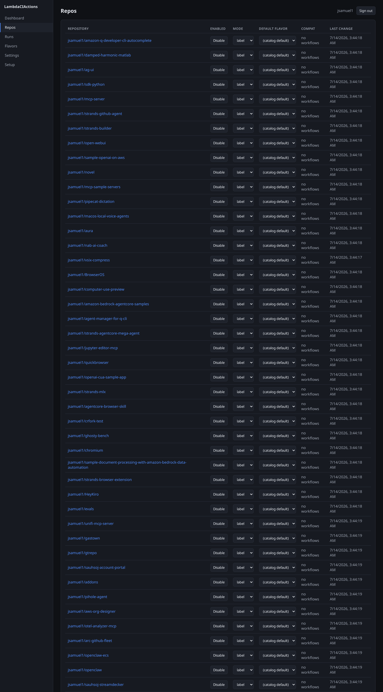
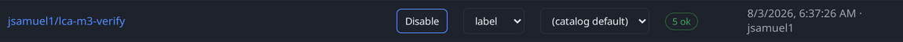
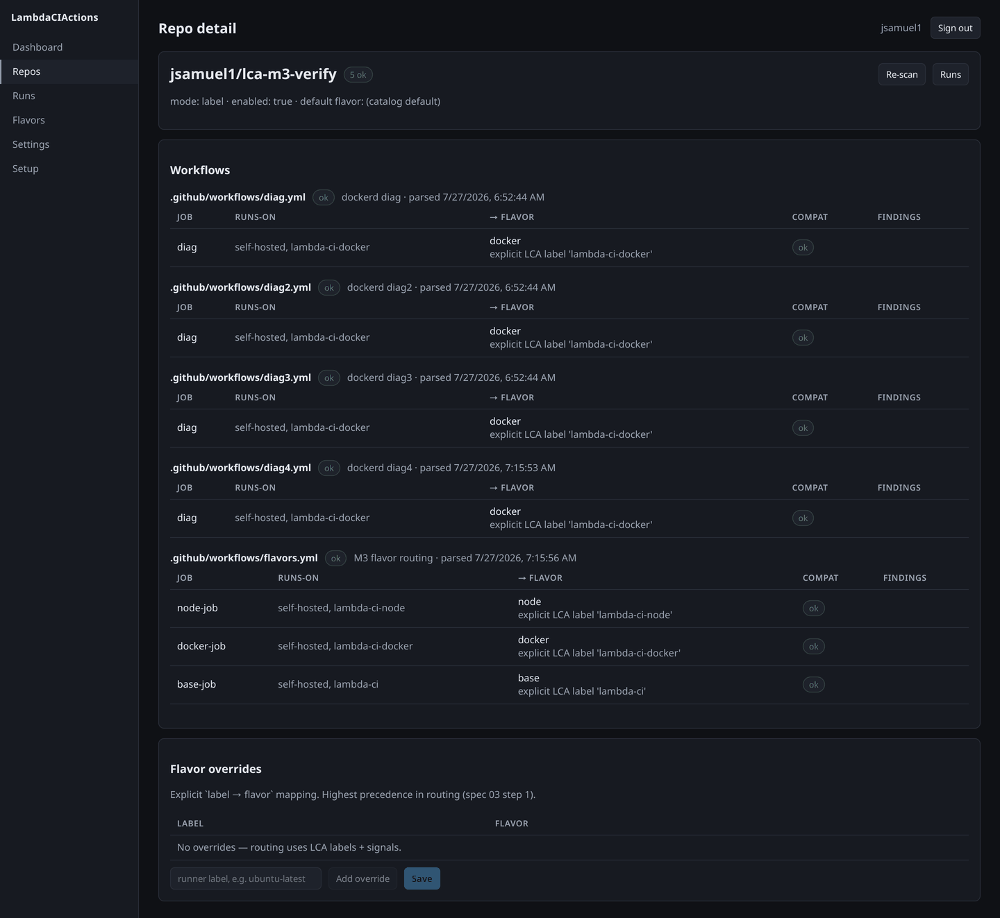
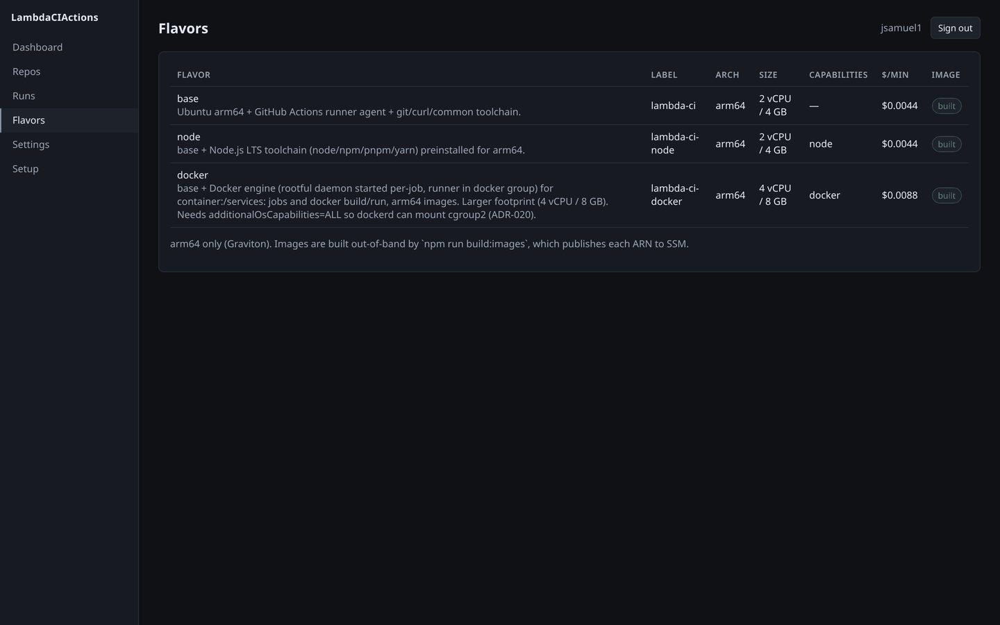
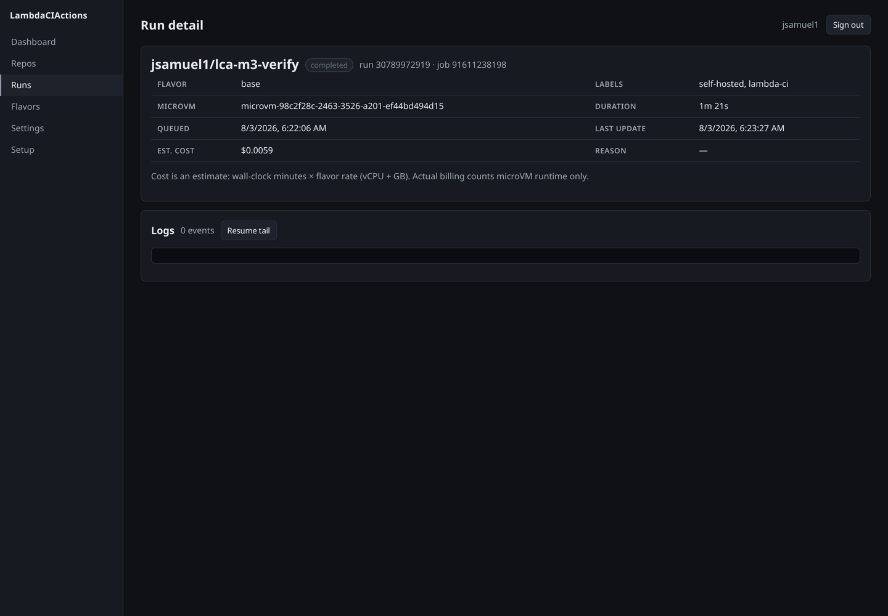
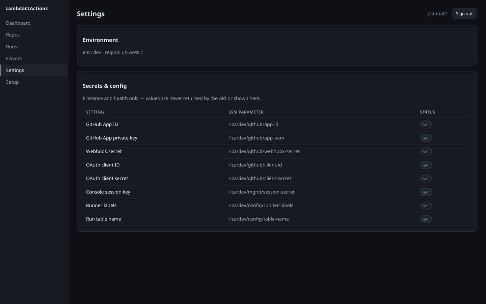

# M4 verification — operator walkthrough of the deployed console

**Verdict: M4 exit criterion NOT met.** 6 of 9 steps pass as observed (3, 4, 5, 6, 8, 9).
Step 1 and the consent half of step 2 are **not verifiable without a human at `github.com`**.
Step 7 — log reading — **fails**.

> 🎯 *An operator installs the App, enables a repo, watches a run to completion, and reads
> its logs — all from the UI.* — `docs/ROADMAP.md` § M4

Walked as an operator against the live `dev` console on **2026-08-03**. Repo enablement,
workflow routing preview, live run tracking, presence-only Settings and the ADR-027 opt-out
gate all work from the UI. The final clause — **"and reads its logs"** — does not: the
run-detail log pane renders `0 events` for every run, including runs whose CloudWatch stream
demonstrably holds the runner output. Root cause found and filed as
[`task-1785738322-0bb6`](#defect-1--run-detail-log-pane-can-never-show-runner-output-p2); it is
a two-line locator bug, **live on `main`**, not a deployment artifact.

Two steps sit outside what this walkthrough could reach at all: the GitHub App's registered
Callback URL (owner-only, and not inferable from an unauthenticated probe — see step 1) and
GitHub's own authorize screen. Both need interactive GitHub credentials.

`docs/ROADMAP.md` § M4 therefore keeps its 🎯 unmarked.

---

## Environment under test

| | |
|---|---|
| Account / region | `863638663908` / `us-west-2` (pinned via `.env.local`, ADR-018) |
| Stacks | `LCA-Mgmt-dev` (`UPDATE_COMPLETE`), `LCA-Web-dev` (`CREATE_COMPLETE`), `LCA-Control-dev`, `LCA-Data-dev`, `LCA-Image-dev` |
| Deployed source | **`63069ff`** "M4: Web UI & Management API" — Mgmt λ `LastModified 2026-07-28T23:37:30Z`, console bundle `main.js` `2026-07-28 23:36:08`. Every later `main` commit is **not** deployed: `10d4d01`, `d74e54a`, `e1bd40e`, `d8d23f1` (vanity origin, ADR-037 install fix, M5 flavors, M5 adopt mode), then `064e26b`..`d3dd0de` (PR #27, M4 CD / ADR-047 — landed 07:39Z, after this walkthrough) |
| Verifying tree | `main` @ `d8d23f1` during the walkthrough (06:15–06:35Z); this document lands on `d3dd0de`. `git diff d8d23f1 d3dd0de -- src/ web/` is **empty**, so nothing between them changes a claim below |
| `ConsoleUrl` | `https://d2x4qcl1ibd2ax.cloudfront.net` (raw CloudFront — no vanity domain configured in this account) |
| Mgmt API | `https://q2s2zkcji8.execute-api.us-west-2.amazonaws.com` (same-origin behind CloudFront, ADR-024) |
| GitHub App | `lambdaciactions-dev` (app id `4292494`, client id `Iv23liqxo1L0yFSPaYws`), installation **`146431062`** on `jsamuel1`, `repository_selection: all`, 139 repos |
| Log groups | `/aws/lambda/microvms/runs/lca-dev`, `/aws/lambda/lca-dev-ingest`, `/aws/lambda/lca-dev-provision` |
| Toolchain | AWS CLI **2.36.8** (`aws lambda-microvms` present; floor ≥ 2.35.17) |
| Fixture repo | `jsamuel1/lca-m3-verify` (repo id **`1313438232`**), branch `m4-verify-01`; workflows `m4-verify.yml` (base) + `m4-verify-docker.yml` (docker), added on that branch for this walkthrough |

Screenshots referenced below are in [`docs/evidence/m4/`](evidence/m4/).

### Prerequisites confirmed before starting

All four passed as-found; nothing was deployed by this verification (deploy is
`task-1785212887-e1c0`'s scope).

| Prereq | Result |
|---|---|
| `LCA-Mgmt-dev` + `LCA-Web-dev` deployed | ✅ both, `ConsoleUrl` as above |
| `PUBLIC_ORIGIN` set on the Mgmt λ | ✅ `https://d2x4qcl1ibd2ax.cloudfront.net` — so no login 500 |
| Session secret at `/lca/dev/mgmt/session-secret` | ✅ `SecureString`, modified `2026-07-28T23:29:56Z` |
| `.env.local` deploy-target pin (ADR-018) | ✅ present; `backfill:installs` printed `✓ deploy target verified: account 863638663908, region us-west-2` |

### How the operator session was obtained — and what that does not cover

The console session is a stateless HMAC-SHA256 token over the SSM secret
`/lca/dev/mgmt/session-secret` (`src/mgmt/session.ts`, ADR-022). This walkthrough minted one
with the **same `encodeSession()` the login callback uses**, carrying the real installation
grant read from the GitHub App API, and drove the deployed SPA in headless Chromium with it.
Everything downstream of the cookie is genuine: the deployed console bundle, the deployed
Mgmt API, real clicks, real 3 s/5 s polling, real screenshots.

What that does **not** exercise is GitHub's browser consent screen and the `code` → token
exchange, which need a human at `github.com`. Those are covered as far as they can be
without one, in step 2 below. **Read every UI claim in this document as "an authenticated
operator sees X", and the OAuth handshake claims as scoped to what is stated there.**

---

## Step 1 — GitHub App callback URL

**NOT VERIFIED — needs a human at `github.com`. Only the console's half is observable.**

What *is* observed: the console requests exactly the documented `redirect_uri`.

```
GET https://d2x4qcl1ibd2ax.cloudfront.net/auth/login  ->  302
  location: https://github.com/login/oauth/authorize
    client_id=Iv23liqxo1L0yFSPaYws
    redirect_uri=https://d2x4qcl1ibd2ax.cloudfront.net/auth/callback
    state=e712ad0c8d1c…  (len 76, signed)
```

What cannot be observed is whether GitHub's registration *matches* it. Two routes were tried
and both are dead ends:

- `GET /app` under an App JWT returns `callback_urls: null` — the field is owner-only.
- Fetching the authorize URL unauthenticated returns `302 → github.com/login?…return_to=…`.
  **That proves nothing.** GitHub defers `redirect_uri` validation until after login: the
  identical 302 comes back for a deliberately bogus value on the same `client_id`.

  ```
  GET https://github.com/login/oauth/authorize?client_id=Iv23liqxo1L0yFSPaYws
        &redirect_uri=https%3A%2F%2Fevil.example.com%2Fcb&state=x
    ->  302  location: https://github.com/login?client_id=Iv23liqxo1L0yFSPaYws&return_to=…
  ```

  An unauthenticated probe therefore cannot distinguish a correct registration from a wrong
  one. An earlier draft of this document read the 302 as acceptance; that inference was wrong
  and is retracted here.

This step is a manual GitHub-UI action and its confirmation is manual too: sign in, complete
the authorize screen, and confirm no `redirect_uri` error. It shares its blocker with step 2
— both need interactive GitHub credentials this walkthrough did not have.

## Step 2 — Sign in with GitHub

**Partially verified — server side fully, GitHub's consent screen not reachable without a human.**

Verified by observation:

| Claim | Evidence |
|---|---|
| SPA shell served at the console root | `GET /` → `200 text/html`, 401 bytes, `<div id="root">`, `<script type="module" src="/main.js">`; `Strict-Transport-Security: max-age=31536000; includeSubDomains`; `Content-Security-Policy: default-src 'none'; script-src 'self'; …` |
| `/auth/login` issues a signed-state cookie | `Set-Cookie: lca_oauth_state=…; Path=/; HttpOnly; Secure; SameSite=Lax; Max-Age=600` |
| A forged `state` is refused | `GET /auth/callback?code=fake-code&state=forged.notasignature` → **`400 {"error":"invalid OAuth state"}`**, no session cookie set |
| Every `/api/*` route refuses an unauthenticated caller | `/api/me`, `/api/installations`, `/api/repos`, `/api/runs`, `/api/flavors`, `/api/settings`, `/api/health` → **all `401 {"error":"not authenticated"}`** |
| A valid session lands in the console, not the login card | `.shell` visible, `.login` absent, nav renders `Dashboard · Repos · Runs · Flavors · Settings · Setup`, header shows `jsamuel1` — [`02-dashboard-signed-in.png`](evidence/m4/02-dashboard-signed-in.png) |

**Not verified:** the GitHub authorization screen and the `code` → access-token exchange,
i.e. that a real human clicking "Authorize" lands in the console. That needs interactive
GitHub credentials. Everything either side of it is verified above.



## Step 3 — Setup screen

**Pass, after a data repair that the deployed vintage required.**

As found, `#/setup` showed **no installations**: `GET /api/installations` returned
`{"installations":[]}` while the platform was actively serving that installation's jobs.

Root cause, established by reading the deployed vintage rather than guessing:
`listInstallations()` queries the GSI1 `INSTALLS` partition, and the `INSTALL#146431062` row
(written `2026-07-14`) carried no `gsi1pk`.

The remedy in this card's brief — *"force with suspend/unsuspend or add/remove a repo"* — **does
not work**, and this walkthrough proved it: an App suspend → unsuspend cycle was executed
(both `204`), the row's `updatedAt` advanced to `2026-08-03T06:15:22.233Z`, and `gsi1pk`
was **still absent**. Reason: only `action: created` routes to `upsertInstallation()`, the
only writer that sets `gsi1pk` (`src/shared/install-store.ts:68` @ `63069ff`). None of the
other lifecycle actions can stamp it: `suspend`/`unsuspend` route to
`setInstallationFlags()`, which `SET`s `suspended`/`deleted`/`updatedAt` on the `INSTALL#`
row and never the index keys; `added`/`removed` route to `enableRepo()`/`disableRepo()`,
which write a **`REPO#` row** and do not touch the installation row at all
(`src/ingest/install-filter.ts` + `src/shared/install-store.ts` @ `63069ff`). That also
explains the observation above — `updatedAt` moving while `gsi1pk` stayed absent is exactly
`setInstallationFlags()`'s write. `docs/DEPLOY-M4.md` on `main` already states
this correctly ("**The installation case does NOT self-heal**") and prescribes the backfill —
the card's note is stale, not the runbook.

Repaired with the shipped tool, which is exactly what it is for (ADR-037):

```
$ npm run backfill:installs -- --table lca-dev
✓ deploy target verified: account 863638663908, region us-west-2
  [dry-run] INSTALL#146431062 → gsi1pk=INSTALLS, gsi1sk=jsamuel1
1 row(s) would be stamped.

$ npm run backfill:installs -- --table lca-dev --apply
  ✓ INSTALL#146431062 → gsi1pk=INSTALLS, gsi1sk=jsamuel1
✓ stamped 1 row(s), skipped 0.

$ npm run backfill:installs -- --table lca-dev        # idempotence
✓ nothing to do — every installation row already carries gsi1pk=INSTALLS
```

After the repair the Setup screen renders ([`03-setup.png`](evidence/m4/03-setup.png)):

```
Installations
ACCOUNT     INSTALLATION   STATE    UPDATED
jsamuel1    146431062      active   8/3/2026, 6:15:22 AM

Platform readiness
All required parameters are present.
```

API calls the SPA made for that screen: `/api/me` 200 → `/api/installations` 200 →
`/api/settings` 200.

**Attribution:** the *code* fix for this (index-aware reads + per-operator reconcile, ADR-037,
commit `d74e54a`) is already on `main` and simply is not deployed here — the Mgmt λ predates
it. Deploying it and re-running the backfill is tracked by **`task-1785508045-4014`**. Treat
this as deployment lag, not a new defect. Had the ADR-037 λ been deployed, the empty state
would have self-healed on first login without the backfill.



## Step 4 — Repos list and enable

**Pass — measured, both directions, with the store write confirmed.**

`#/repos` listed **139 repos** for installation `146431062`, each row carrying an
enable/disable button, a `label`/`adopt`/`off` mode selector, a default-flavor override
(`(catalog default)` · `base` · `node` · `docker`) and a compat rollup (`no workflows` for
repos never scanned).



The fixture repo was already enabled, so the control was exercised by flipping it away and
back — every click was a real click on the deployed console, and each was checked through to
DynamoDB:

| Action | UI button after | `PATCH /api/repos/1313438232` | DynamoDB `INSTALL#146431062 / REPO#1313438232` |
|---|---|---|---|
| click `Disable` | `Enable` | `200` `{…"enabled":false,"mode":"label","updatedBy":"jsamuel1"…}` | `enabled=false`, `updatedAt=2026-08-03T06:18:43.273Z`, `updatedBy=jsamuel1` |
| click `Enable` | `Disable` | `200` `{…"enabled":true…}` | `enabled=true`, `updatedAt=2026-08-03T06:18:47.918Z`, `updatedBy=jsamuel1` |

UI state, API response and stored row agreed on every transition, and the write is audited
with the operator's login (spec 04 § auditability).




## Step 5 — Repo detail: parsed workflows, routing preview, compat

**Pass. No re-scan needed** — the parse rows were already present, so
`POST /api/repos/{repoId}/rescan` was not exercised.

`#/repos/1313438232` rendered a `5 ok` compat rollup, a `Re-scan` button, `mode: label ·
enabled: true · default flavor: (catalog default)`, and per-workflow tables with the per-job
routing decision **and its reason**:

| Workflow | Job | `runs-on` | → flavor | Reason | Compat |
|---|---|---|---|---|---|
| `flavors.yml` | `node-job` | `self-hosted, lambda-ci-node` | `node` | explicit LCA label `lambda-ci-node` | ok |
| `flavors.yml` | `docker-job` | `self-hosted, lambda-ci-docker` | `docker` | explicit LCA label `lambda-ci-docker` | ok |
| `flavors.yml` | `base-job` | `self-hosted, lambda-ci` | `base` | explicit LCA label `lambda-ci` | ok |
| `diag.yml`, `diag2.yml`, `diag3.yml`, `diag4.yml` | `diag` | `self-hosted, lambda-ci-docker` | `docker` | explicit LCA label `lambda-ci-docker` | ok |

A **Flavor overrides** editor ("Explicit `label → flavor` mapping. Highest precedence in
routing (spec 03 step 1)") was present, empty, with `Add override` / `Save`. The four `diag*`
workflow rows are stale parse history — those files no longer exist in the repo — which is
the documented per-workflow behaviour, not a defect.



The Flavors screen listed all three flavors as `built`, `arm64`, with
labels and per-minute rates. Note the sizes shown (`2 vCPU / 4 GB`, `4 vCPU / 8 GB`) are the
pre-ADR-038 catalog values baked into the deployed M4 bundle; ADR-038 (M5, on `main`,
undeployed) establishes that those shapes were never actually requested. Cosmetic here, and
already corrected upstream.



## Step 6 — Push a commit, watch the run advance without reloading

**Pass.** Every status reading below is the console's own rendering; after the initial
navigation the harness **never reloaded** — updates arrived via the SPA's 3 s/5 s polling
(ADR-026).

Six pushes were made to `jsamuel1/lca-m3-verify` on branch `m4-verify-01`, plus one
`workflow_dispatch`. `main` was deliberately not touched, so the base fixture
(`m4-verify.yml`) and the docker fixture (`m4-verify-docker.yml`) both trigger on
`m4-verify**`. Runs produced:

| Run | Job | Flavor | microVM | Status | Created |
|---|---|---|---|---|---|
| `30789972919` | `91611238198` | `base` | `microvm-98c2f28c-2463-3526-a201-ef44bd494d15` | completed | 06:22:06Z |
| `30790275739` | `91612121591` | `base` | `microvm-21cd490c-cdea-3cee-9249-cbc32b920383` | completed | 06:27:30Z |
| `30790398929` | `91612498741` | `base` | `microvm-2e3f618b-12f8-3e1b-b7af-86d883eadc64` | completed | 06:29:53Z |
| `30790440697` | `91612619972` | `base` | `microvm-d8791e66-c8d6-3bb9-a860-ac47665cd7a1` | completed | 06:30:36Z |
| `30790531580` | `91612897553` | `base` | `microvm-3d03a83c-8eb4-3813-bd52-9737816baa65` | completed | 06:32:22Z |
| `30790531634` | `91612897831` | `docker` | `microvm-b16a8825-d957-336f-b20b-39f7170e8b34` | completed | 06:32:22Z |
| `30790672874` | `91613320319` | `docker` | `microvm-d0c65090-0cf1-395b-b09a-cf1728251227` | completed | 06:35:01Z |

All GitHub conclusions `success`. Every row above is `event: push` except `30790672874`,
which was a `workflow_dispatch` on the same branch (`gh run list --json event` confirms) — it
was dispatched to re-observe `provisioning` on the slower docker flavor. Statuses **as
rendered by the console**:

| Status | Where seen | Evidence |
|---|---|---|
| `queued` | Runs list, 06:28:09Z | run `30790275739` row read straight from the DOM — [`06b-runs-list-queued.png`](evidence/m4/06b-runs-list-queued.png) |
| `provisioning` | Runs list, 06:35:0xZ | run `30790672874 / 91613320319` badge — [`06d-runs-list-provisioning.png`](evidence/m4/06d-runs-list-provisioning.png) |
| `running` | Run detail, 06:22:13Z / 06:28:15Z / 06:30:23Z / 06:32:24Z | [`06-rundetail-1-running.png`](evidence/m4/06-rundetail-1-running.png) |
| `completed` | Run detail, 06:23:31Z / 06:28:51Z / 06:31:14Z / 06:33:39Z | [`07-rundetail-final-completed.png`](evidence/m4/07-rundetail-final-completed.png) |

`running → completed` was observed **in-place four times** with no reload — e.g. run
`30790275739`: `running` at `06:28:15.882Z`, `completed` at `06:28:51.020Z`, on the same
mounted page. Poll traffic for one such watch: `/api/runs/1313438232/30789972919/91611238198`
× 30, `…/logs` × 21, `/api/health` × 21, `/api/runs` × 21 over ~3 minutes — the UI is
genuinely self-refreshing.

**`provisioning` is short-lived and needed a slower flavor to catch in the UI.** On the `base`
flavor the Provision λ writes `provisioning` and the microVM launches **~0.9 s later**
(`06:29:54.157Z` transition → `06:29:55.043Z` `microVM launched`), so a 3 s-polling UI
usually misses it — a fast 400 ms API poll caught it once
(`{jobId: 91612897553, status: "provisioning"}` at `06:32:23.005Z`) but the page had already
advanced by the time it painted 1.9 s later. The `docker` flavor holds the state for ~60 s
(run created `06:32:21Z`, GitHub job started `06:33:22Z`), and a 250 ms DOM poll on the Runs
list caught the console rendering it. **This is a timing property, not a defect** — the state
is written, served and rendered correctly.

The Dashboard showed the fixture runs alongside real platform-wide counts
(`ACTIVE 0 · QUEUED 0 · RUNNING 0 · ERROR RATE 15% · REPOS ENABLED 139`), with flavor and
duration per row — [`02-dashboard-signed-in.png`](evidence/m4/02-dashboard-signed-in.png).

## Step 7 — Read the run's logs from the UI

**FAIL. This is what blocks the exit criterion.**

The run-detail header is correct and complete for run `30789972919` / job `91611238198`:

```
jsamuel1/lca-m3-verify   completed
run 30789972919 · job 91611238198
FLAVOR   base                                       LABELS   self-hosted, lambda-ci
MICROVM  microvm-98c2f28c-2463-3526-a201-ef44bd494d15  DURATION  1m 21s
QUEUED   8/3/2026, 6:22:06 AM                       LAST UPDATE  8/3/2026, 6:23:27 AM
EST. COST $0.0059                                   REASON   —

Logs
0 events
Resume tail
```

`0 events` — for a job GitHub reports as **success**, on a microVM whose CloudWatch stream
holds the runner output. Reproduced on the `docker` run `30790672874` as well (also
`0 events`). Earlier in the run the pane reads *"No log stream yet — the microVM has not
started writing"* and never leaves that state before flipping to an empty `0 events`.

The logs exist:

```
$ aws logs describe-log-streams --log-group-name /aws/lambda/microvms/runs/lca-dev \
    --order-by LastEventTime --descending
  2026/08/03[10.0]microvm-98c2f28c-2463-3526-a201-ef44bd494d15   <-- the run's stream

$ aws logs get-log-events --log-stream-name '2026/08/03[10.0]microvm-98c2f28c-…'
  {"ts":"2026-08-03T06:22:13.183Z","src":"run-hook","msg":"job starting","runId":30789972919,…}
  √ Connected to GitHub
  2026-08-03 06:22:19Z: Running job: m4-console
  2026-08-03 06:23:25Z: Job m4-console completed with result: Succeeded
  {"ts":"2026-08-03T06:23:25.514Z","src":"run-hook","msg":"self-terminate requested",…}
```

Root cause: the stream is named `<date>[<imageVersion>]<microvmId>`, so the microVM id is a
**suffix** — but `fetchRunLogs()` and `hasLogStream()` both pass
`logStreamNamePrefix: microvmId` (`src/mgmt/logs.ts:77`, `:118`). Measured, same group, same
microVM id:

```
filter-log-events  --log-stream-name-prefix microvm-98c2f28c-…  ->  {"events": 0, "searched": []}
describe-log-streams --log-stream-name-prefix microvm-98c2f28c-…  ->  0
filter-log-events  --log-stream-names '2026/08/03[10.0]microvm-98c2f28c-…'  ->  5
```

`src/mgmt/logs.ts` has **zero diff between `63069ff` and `main` @ `d3dd0de`** (current tip,
and likewise at `d8d23f1`), so this is live on `main` — deploying newer code will not fix it.
Filed as **`task-1785738322-0bb6`** (P2) with a fix sketch.

Why the existing unit tests never caught it: `test/mgmt-logs.test.mjs` stubs the CloudWatch
client with a **scripted response queue that ignores `logStreamNamePrefix` entirely** — it
replies with the next canned page whatever prefix is sent, so no test in the file can observe
a wrong locator direction. Worse, line 51 *asserts* the buggy direction as correct
(`assert.equal(input.logStreamNamePrefix, 'vm-1')`), and the fixture stream names (`vm-1/x`,
with `microvmId: 'vm-1'`) happen to be id-prefixed, so even a prefix-aware stub would match.
A regression test with a realistic name (`2026/08/03[10.0]microvm-…`) therefore only bites if
the stub is first taught to filter by prefix the way CloudWatch does **and** that assertion is
inverted.



## Step 8 — Settings shows presence only

**Pass — presence observed; non-disclosure is by construction, not by penetration test.**

`#/settings` rendered `env: dev · region: us-west-2`, the note *"Presence and health only —
values are never returned by the API or shown here"*, and eight rows **all reading `set`**:

| Setting | SSM parameter | Status |
|---|---|---|
| GitHub App ID | `/lca/dev/github/app-id` | set |
| GitHub App private key | `/lca/dev/github/app-pem` | set |
| Webhook secret | `/lca/dev/github/webhook-secret` | set |
| OAuth client ID | `/lca/dev/github/client-id` | set |
| OAuth client secret | `/lca/dev/github/client-secret` | set |
| Console session key | `/lca/dev/mgmt/session-secret` | set |
| Runner labels | `/lca/dev/config/runner-labels` | set |
| Run table name | `/lca/dev/config/table-name` | set |

As the card directs, the non-disclosure claim is **verified by construction**: the `settings`
case in `src/mgmt/handler.ts` reads presence via `DescribeParameters`, which returns metadata
only and never a `Value`. As a weak corroboration the rendered pane text was scanned for
PEM headers, `gh*_` tokens and long hex strings and matched none — that is a sanity check on
this one screen, **not** a secret-exfiltration test.



## Step 9 — ADR-027 repo opt-out gate

**Pass — disabled from the UI, refusal observed in the Ingest log.**

The repo was disabled **through the console** (`PATCH /api/repos/1313438232` → `200`,
`enabled=false`, `updatedAt=2026-08-03T06:35:19.546Z`, `updatedBy=jsamuel1`), then a commit
was pushed at `06:35:36Z`. Ingest refused both jobs, verbatim:

```
2026-08-03T06:35:39.623Z  {"msg":"job not claimed — repo opted out","repo":"jsamuel1/lca-m3-verify","enabled":false,"mode":"label"}
2026-08-03T06:35:39.735Z  {"msg":"job not claimed — repo opted out","repo":"jsamuel1/lca-m3-verify","enabled":false,"mode":"label"}
```

Consequence confirmed at GitHub: runs `30790711449` and `30790711604` stayed `queued` with no
runner claiming them (cancelled afterwards to clean up), and **no run rows were written** for
them. The repo was then re-enabled from the UI (`enabled=true`, audited).

The `202 {ok: true, claimed: false, disabled: true}` response shape is **verified by
construction**, not observed: it is the `return json(202, …)` on the line immediately after
the log statement above (`src/ingest/handler.ts` @ `63069ff`, line 154). A webhook response
body is not recoverable from CloudWatch.

**This gate fails open by design** (ADR-027 consequences): a missing repo row or a DynamoDB
fault is caught and the job still runs. This walkthrough demonstrates the gate on the happy
path — it does **not** establish strictness under a read fault.

---

## Defects found

### Defect 1 — run-detail log pane can never show runner output (P2)

**`task-1785738322-0bb6`.** `logStreamNamePrefix: microvmId` in `src/mgmt/logs.ts:77`/`:118`,
but the microVM id is a stream-name **suffix**. Evidence and fix sketch in step 7 and on the
card. **Live on `main`** — zero diff since `63069ff`. This is the only *product defect* found,
and the only blocker that is a defect at all — but it is **not** the only thing standing between
this walkthrough and a marked 🎯. Landing it clears the criterion's *"reads its logs"* clause;
the *"installs the App"* clause still needs the interactive GitHub half of steps 1–2 walked by
a human. Both are preconditions for marking.

### Non-defects encountered (recorded so the next walkthrough doesn't re-litigate them)

| Observation | Disposition |
|---|---|
| `#/setup` empty on arrival | Deployment lag, not a defect. The ADR-037 fix is on `main`, undeployed; backfill repaired it. Tracked by `task-1785508045-4014`. |
| Suspend/unsuspend does **not** repair `gsi1pk` | The card's remedy is wrong for any vintage — only `installation.created` reaches `upsertInstallation()`. `docs/DEPLOY-M4.md` on `main` already says so and prescribes the backfill; no doc change needed. |
| `provisioning` rarely visible on `base` | Real timing property: ~0.9 s between the transition and VM launch. Caught on `docker` (~60 s dwell). |
| Stale `diag*.yml` rows on repo detail | Parse history for deleted workflow files; documented behaviour. |
| Flavor sizes shown as `2 vCPU / 4 GB` etc. | Pre-ADR-038 catalog text in the deployed M4 bundle; corrected on `main`. |
| Run `30790210060` failed | **My fixture error** — appended `//` to YAML. Invalid workflow, GitHub failed it before any `workflow_job` event, so no run row. Not a platform fault. |
| `DEPLOY-M4.md` ADR cross-link anchors | Already correct on `main` (`#adr-022`, `#adr-024`, `#adr-025`). The card's note is stale; no fix applied. |
| Unauthenticated authorize-URL probe reads as a callback-URL check | **It is not one.** GitHub defers `redirect_uri` validation until after login, so a bogus value 302s to `/login` identically (probe in step 1). An earlier draft of this document drew the opposite conclusion; retracted. |

## Reproducing

```sh
# 0. pin the target; credentials must resolve to it (ADR-018)
cp .env.local.example .env.local        # LCA_DEPLOY_ACCOUNT / LCA_DEPLOY_REGION / LCA_DEPLOY_ENV=dev

# 1. prerequisites
aws cloudformation describe-stacks --query 'Stacks[?starts_with(StackName,`LCA-`)].StackName'
aws lambda get-function-configuration --function-name lca-dev-mgmt \
  --query 'Environment.Variables.PUBLIC_ORIGIN'          # must be the ConsoleUrl
aws ssm describe-parameters --parameter-filters \
  "Key=Name,Option=BeginsWith,Values=/lca/dev/" --query 'Parameters[].Name'

# 2. installations visible on Setup (only needed pre-ADR-037 λ)
npm run build && npm run backfill:installs -- --table lca-dev            # dry run
npm run backfill:installs -- --table lca-dev --apply

# 3. sign in at the ConsoleUrl and walk #/setup, #/repos, #/repos/<id>, #/runs, #/flavors, #/settings

# 4. drive a run: push to a branch the fixture workflows watch (`m4-verify**`), then watch
#    #/ and run detail. Dispatch also works on that branch:
gh workflow run m4-verify-docker.yml --repo <owner>/lca-m3-verify --ref m4-verify-01

# 5. the log-pane defect, without a browser
MV=<microvmId from the run row>
aws logs filter-log-events --log-group-name /aws/lambda/microvms/runs/lca-dev \
  --log-stream-name-prefix "$MV"                                  # 0 events  <- what the API does
aws logs describe-log-streams --log-group-name /aws/lambda/microvms/runs/lca-dev \
  --order-by LastEventTime --descending --max-items 3              # find the real stream name
aws logs filter-log-events --log-group-name /aws/lambda/microvms/runs/lca-dev \
  --log-stream-names '<YYYY/MM/DD>[<ver>]'"$MV"                    # the events are there

# 6. ADR-027 opt-out gate
#    disable the repo in the console, push, then:
aws logs tail /aws/lambda/lca-dev-ingest --since 3m | grep 'repo opted out'
```
